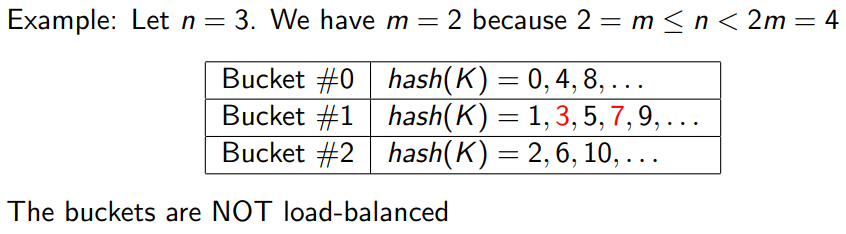

## 1 基于哈希的索引结构

外存哈希表：由桶组成，entry K被放在hash(K)号桶中，每个桶存储一个指向页面链表的指针

外存哈希表的分类：

* 静态哈希表：桶的数量不变
* 动态哈希表
    * 可扩展哈希表
    * 线性哈希表

### 可扩展哈希表

由$2^i$个桶组成，$i$是global depth

每个页用$j$位来决定此页属于哪个桶，$j$为local depth

全局深度大于等于任何页面的局部深度。若某页的局部深度比全局深度小，则此页被多个桶共享。

查找：先计算entry的hash值，然后确定在哪个桶里，然后在桶指向的页面里寻找

插入：找到需要插入的page P，如果P有足够的空间，插入，否则分裂出一个新页P'
如果P的local depth小于global depth，则增加local depth；若local和global相等，则将global depth增加1，即将桶的数量加倍，重新组织页面，若溢出则分页：

​	：找到entry然后删除

### 线性哈希表

每个桶维护一个指向页链表的指针，假设每个页最多b个entry，整个哈希表能存储的entry数量最多为$\theta bn$

桶号为0~n-1，取$m\le n \lt 2m$，m是2的幂。如果hash(K)模2m=Q小于n，则K属于Q号桶；否则其属于hash(K)模m。

插入：

将entry数量增加1，若增加后小于$\theta bn $，则成功，若entry数超出一夜的限制，则在页链表后增加一页：

否则将n（桶数）增加1，并且重新组织桶中的entries：

可扩展哈希表和线性哈希表的对比：

## 2 基于树的索引结构

B+树：

* 所有叶节点深度相同
* 除了根节点，所有节点至少半满：[M/2-1, M-1]
* 有k个值的内部节点有k+1个非空孩子
* 每个结点是一个页，每个页存很多内容

叶节点有指向其兄弟结点的指针；内部节点维护指向儿子结点的指针；根节点至少有一个值。

区间查询：先找到最小的，然后沿着兄弟指针一直找。

插入：若溢出，分成两个结点，均分keys，将中间的key插入父亲节点；分裂内部节点：均分，将中间key向上push。左边是小于，右边大于等于。

删除：若少于半满，1、向兄弟借；2、借不了就合并，再将父亲的key删除。

### Key Compression:

前缀压缩：提取共同前缀；将内部节点冗余的后缀截断；

批量加载：从下往上构造B+树，而不是从上往下一个个插入

## 3 Log-Structured Merge-Trees

首先将所有的写操作缓存在内存中，之后将其写进disk中，并且使用顺序IO将他们合并

