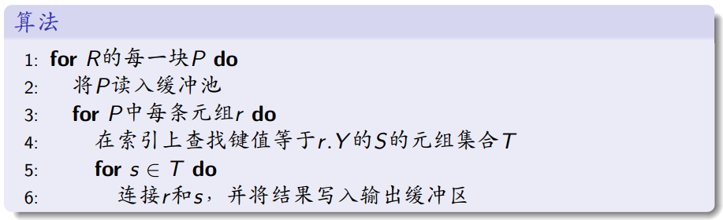

## 1、概述

给定SQL查询，经过SQL parser和translator，可以被翻译成一系列有顺序的关系代数表达式。

这些关系代数表达式经过查询优化器，获得更优的查询计划。

之后将这些查询计划送给查询执行器执行。

## 2、外排序

排序：排序是关系代数操作执行过程的重要步骤

* 用户的ORDER BY
* 批量加载B+树的第一步是对索引项排序

当数据规模大到无法全部载入内存时，需要使用**外排序**算法。

外排序的开销用磁盘I/O次数来衡量，CPU计算时间可近似忽略。故外排序算法的目标就是：最小化I/O次数。

### 外部归并排序

**两趟多路外存归并排序：**

记法：N是R的元组数，M是缓冲池可用内存页数，B是每块最多存B个元组，B(R)=$\lceil N/B\rceil$是R的块数。一块就是一页。

**创建归并段：**将关系R划分成$\lceil B(R)/M\rceil$个归并段，需要2B(R)次IO

**多路归并：**

算法分析：直接输出，输出不计入算法的IO代价

* IO代价：3B(R)，创建归并段两次，归并一次
* 可用内存页数要求：$B(R)\le M^2$，每个归并段最多M页，最多M个归并段

若$B(R)\gt M^2$，需要执行多趟多路外存归并排序，IO代价是(2m-1)B(R)，m是算法执行的趟数

### 多路归并排序的优化：

问题：若某缓冲页中的所有元组都归并完毕，DBMS需读入其归并段的下一块，此时归并进程将被挂起，直至IO完成。

解决：双缓冲，将下一块读入空闲的缓冲页。

## 3、关系代数操作的执行

### 3.1 选择操作

记法：T(R)是关系R的元组数，B(R)是关系R的块数，M是缓冲池可用内存页数，V(R,A)是关系R的属性集A的不同值的个数

**基于扫描的选择算法**

算法分析：IO代价为B(R)（聚簇存储，一个元组再一个文件中）或T(R)（所有元组都不在一个页上），要求$M\ge 1$

**基于哈希的选择算法**

前提：关系R使用哈希文件组织形式，属性K是R的哈希键，等值查询

算法：1、根据hash值确定桶；2、在桶页面中寻找

算法分析：IO代价约为$\lceil B(R)/V(R,K)\rceil$，要求$M\ge1$

**基于索引的选择算法**

前提：选择条件为对K的等值或范围查询，R上建有属性K的索引

* 若聚簇索引，IO代价约为$\lceil B(R)/V(R,K)\rceil$；
* 否则，$\lceil T(R)/V(R,K)\rceil$；

### 3.2 投影操作

不去重：和基于扫描的选择算法相同

去重：

**一趟去重算法：**

在内存页中用哈希表记录见过的元组

IO代价还是B(R)或T(R)，可用内存页数要求：$B(\delta(R))\le M-1$，$\delta(R)$为R中不同元组的个数。

**基于排序的去重算法：**

1、创建归并段阶段，按整个元组进行排序；2、在归并阶段，相同元组只输出1个。

IO代价3B(R)，内存页数要求$B(R)\le M^2$

**基于哈希的去重算法：**

不同桶的元组一定不同，重复元组一定在相同的桶中

3B(R)：哈希分桶一次，写入文件一次，每个桶执行一次去重一次

内存页数要求$B(R)\le (M-1)^2$，共M-1个桶，每个桶不超过M-1块。

### 3.3 聚集操作（本质上和去重操作一样）

### 3.4 集合差操作

**一趟集合差：**

IO代价：B(S)+B(R)；内存页数要求：B(S)<=M-1，内存查找结构约占B(S)页

**基于排序的集合差：**

IO代价：3B(R)+3B(S)；可用内存页数要求：$B(R)+B(S)\le M^2$，每个归并段最多M块，R和S共有不超过M个归并段

**基于哈希的集合差：**

IO代价：3(B(R)+B(S))；可用内存页数要求：B(S)<=(M-1)^2

### 3.5 集合并、集合交和差一样

### 3.6 连接操作

**一趟连接：**

假设B(S)<=B(R)

IO代价为B(R)+B(S)，可用内存页数为$B(S)\le M-1$

**基于元组的嵌套循环连接：**

IO代价为T(S)T(R)+T(S) ，$M\ge 2$，一个读R一个读S

**基于块的嵌套循环连接：**

IO代价为B(S)+B(R)B(S)/(M-1)，M>=2

**排序归并连接：**

IO代价：3B(R)+3B(S)；可用内存页数要求：$B(R)+B(S)\le M^2$

**哈希连接：**

IO代价：3B(R)+3B(S)；可用内存页数要求：$B(S)\le (M-1)^2$，共有M-1个桶，每个桶不超过M-1块。

**基于索引的连接：**

假设关系S上建有Y的索引

## 4、表达式的执行

